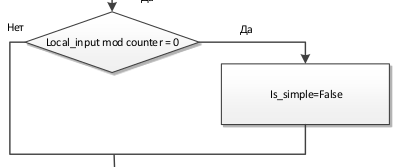
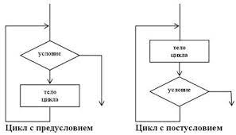

1) Развлетвляющийся алгоритм - это алгоритм, в котором та или иная серия команд выполняется в зависимости от истинности
условия
2) При выполнении условного оператора с одной ветвью if вычисляется условие, и если оно 
истинно, то выполняются команды после:, в противном случае выполнение программы продолжается 
со следующей за условным оператором команды
3) 
4) Циклический алгоритм - алгоритм, в котором действия повторяются конечное число раз.
5) Существует 3 основных вида циклов: цикл с условем; цикл с предусловием; Совместный цикл (цикл по коллекциям).
6) 
7) Через range в цикле for, или с помощью дополнительной переменной и цикла while с break условием
8) Итераторы, реализованные по-разному для различных классов (например, для кортежа и словаря) позволяют циклу for перемещаться по коллекциям, не заботясь о внутренней структуре объектов, а используя методы \_\_iter__() и \_\_next__().
   Вызов \_\_next__() завершается возбуждением исключения StopIteration, означающим, что элементов в коллекции больше нет
9) Итерируемые объекты также поддерживаются рядом полезных функций:
   + all(iterable) Возвращает True, если все элементы iterable в логическом контексте оцениваются как True.
   + any(iterable) Возвращает True, если хотя бы 1 элемент iterable в логическом контексте оцениваются как True.
   + enumerate(iterable, start=0): Возвращает итератор, где каждый элемент является парой «номер» - «значение». Номер отсчитывается от start. Обычно используется в циклах for, чтобы получить последовательность кортежей (номер, элемент).
   + sorted(iterable, key=None, reverse=False)
   + reversed(iterable)
10) Линейный алгоритм – это алгоритм, в котором все действия следуют в определённой последовательности друг за другом, не повторяясь. Алгоритм с ветвлением – это алгоритм, в котором в зависимости от условия, выполняется либо одна часть алгоритма, либо другая.
11) Потому что при выполнении первой операции значение переменной "а" пропадет